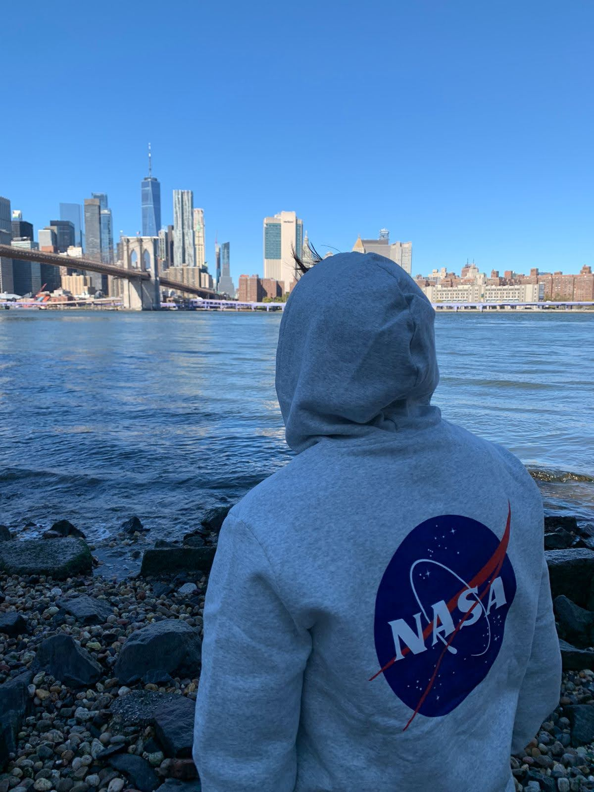
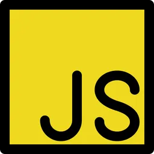

### Hi there 👋

<!-- 

  

 -->
I am Nico, developer working with  environments  

💻 Currently working at [Denode](https://denode.com/) & contributing to [Rise](https://github.com/RisingSquad)

<!-- 
- 🔭  I’m currently working with .ts
- 🌱  And learning Deno & fresh framework [https://fresh.deno.dev/](https://fresh.deno.dev/)
- 😄  I’m curious to check [https://bun.sh/](https://bun.sh/) & [https://github.com/modularml/mojo](https://github.com/modularml/mojo) next!
 -->
<!-- 
**zk182/zk182** is a ✨ _special_ ✨ repository because its `README.md` (this file) appears on your GitHub profile.

Here are some ideas to get you started:

- 🔭 I’m currently working on ...
- 🌱 I’m currently learning ...
- 👯 I’m looking to collaborate on ...
- 🤔 I’m looking for help with ...
- 💬 Ask me about ...
- 📫 How to reach me: ...
- 😄 Pronouns: ...
- ⚡ Fun fact: ...
-->
